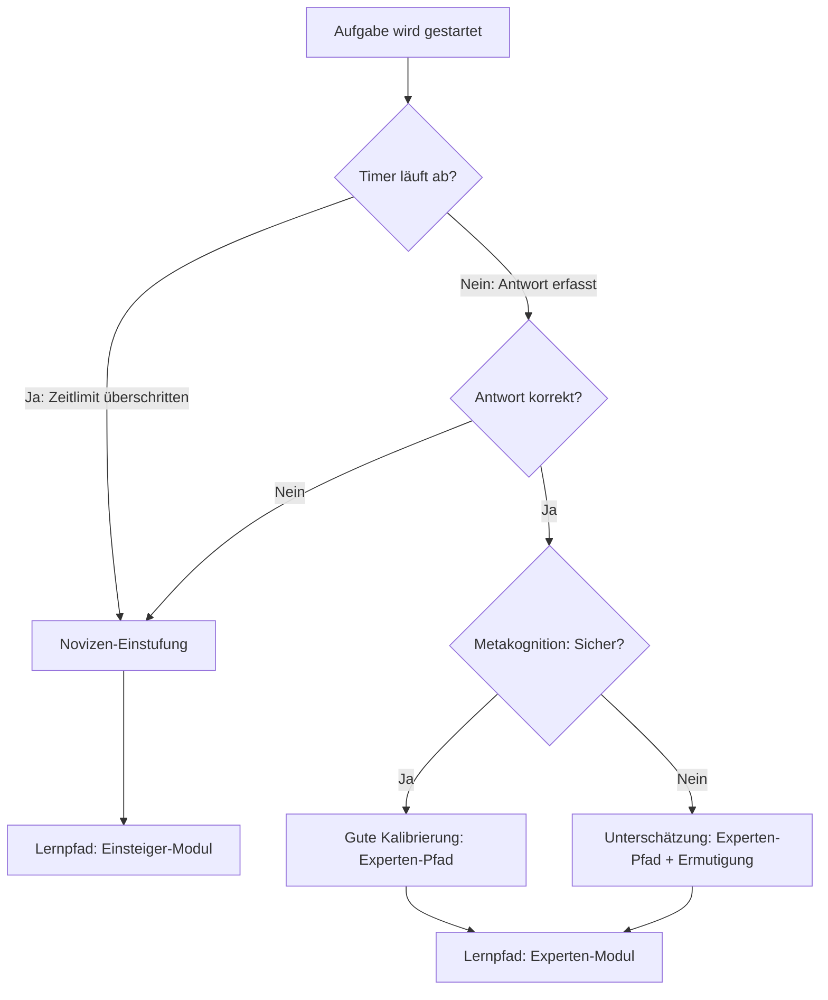

# Benutzerhandbuch: H5P.RapidTimer (Zeitrahmen-Wrapper)
*Konzeption, Didaktik und Editor-Bedienung in Lumi*

Dieses Handbuch beschreibt die Konfiguration und Verwendung des H5P-Moduls **RapidTimer** (`H5P.RapidTimer`), einer Eigenentwicklung zur Einbettung und zeitlichen Steuerung beliebiger H5P-Aufgaben. 

---

## 1. Didaktischer & Wissenschaftlicher Hintergrund

Das Modul **RapidTimer** basiert auf der **Cognitive Load Theory (CLT)** (Sweller et al.) und insbesondere auf der **Rapid Assessment Method** (auch *Rapid Verification Technique* oder *Rapid Test Method*) nach **Slava Kalyuga**.

### Der Expertise-Reversal-Effekt & Schema-Erfassung
Herkömmliche Testverfahren erlauben es Lernenden, Probleme durch zeitaufwendige, allgemeine Problemlösungsstrategien (z. B. *Means-Ends-Analysis*) zu lösen. Diese Strategien belasten das Arbeitsgedächtnis stark und spiegeln nicht zwingend stabile Wissensstrukturen (Schemata) im Langzeitgedächtnis wider.
Kalyugas Rapid-Testing-Methode setzt ein **enges Zeitfenster** (Richtwert: **6 bis 10 Sekunden**), in dem eine Aufgabe erfasst und beantwortet werden muss. 
*   **Experten** können die Aufgabe sofort durch automatisierten Schema-Abruf lösen.
*   **Novizen** scheitern, da ihnen die Zeit fehlt, eine Lösung von Grund auf neu zu konstruieren.
Dies ermöglicht eine schnelle, präzise Diagnose des Wissensstands (Expertise), um darauf aufbauend adaptive Lernpfade bereitzustellen.

### Metakognitive Kalibrierung (Confidence-Based Marking)
Ergänzend kombiniert dieses H5P-Modul das Zeitlimit mit einer **Sicherheitsabfrage (Confidence)**. Dadurch wird die metakognitive Genauigkeit der Lernenden erfasst:
1.  **Sicher + Richtig (Experte/Gut kalibriert)**: Das Wissen sitzt stabil.
2.  **Unsicher + Richtig (Unterkonfident)**: Die Person tippt richtig, zweifelt aber. Hier ist Ermutigung notwendig.
3.  **Sicher + Falsch (Überkonfident/Fehlvorstellung)**: Ein gefährlicher Zustand, in dem eine Fehlannahme (*Misconception*) vorliegt. Ein gezielter Lernpfad must diese dekonstruieren.
4.  **Unsicher + Falsch (Realistischer Novize)**: Die Person weiß, dass sie es nicht weiß. Grundlagenschulung ist angezeigt.

---

## 2. Editor-Bedienung in Lumi (Autoren-Sicht)

Das Modul wird direkt in Lumi editiert. Es dient als "Wrapper", d. h. es umhüllt eine andere H5P-Aufgabe.

*Abbildung 1: Die Editor-Einstellungen für RapidTimer in Lumi.*

### Die Parameter im Detail

#### A. Eingebetteter H5P-Inhalt (`content`)
Wähle hier die Aufgabe aus, die zeitlich begrenzt werden soll. Unterstützt werden standardmäßig:
*   `H5P.MultiChoice` (Mehrfachauswahl)
*   `H5P.TrueFalse` (Richtig/Falsch)
*   `H5P.Blanks` (Lückentext)
*   `H5P.SingleChoiceSet` (Single-Choice-Reihen)
*   `H5P.MarkTheWords` (Wörter markieren)
*   `H5P.DragText` (Text ziehen)
*   `H5P.Summary` (Zusammenfassung)

#### B. Zeitlimit (`timeLimit`)
*   **Standard**: `10` Sekunden.
*   **Didaktische Empfehlung**: `6` bis `10` Sekunden für einfache Schema-Abfragen. Bis zu `30` Sekunden bei kurzen mathematischen Umformungen.

#### C. Start des Timers (`startMode`)
*   `Sofort beim Laden` (`immediate`): Der Timer beginnt zu laufen, sobald das Element auf dem Bildschirm erscheint.
*   `Per Klick auf Start-Button` (`click` - *empfohlen*): Gibt der lernenden Person Orientierungszeit. Der Timer und die Aufgabe werden erst sichtbar, wenn der Button aktiv angeklickt wird.

#### D. Warnung ab verbleibenden Sekunden (`warningAt`)
*   Färbt die Ziffern und die Zeitleiste rot (z. B. ab `3` Sekunden vor Ablauf), um den Zeitdruck visuell zu verdeutlichen. Setze auf `0`, um die Warnung zu deaktivieren.

#### F. Fortschrittsbalken anzeigen (`showBar`)
*   Blendet eine visuelle, schrumpfende Zeitleiste am oberen Rand ein.

#### G. Verhalten bei Zeitablauf (`onTimeout`)
*   `Aufgabe sperren` (`lock`): Die Aufgabe wird sofort durch ein transparentes Overlay abgedeckt und kann nicht mehr bearbeitet werden. Dies führt zur Einstufung als Novize.
*   `Nur Hinweis anzeigen` (`notify`): Der Hinweis erscheint, die Aufgabe bleibt jedoch bedienbar. Nützlich für formative Szenarien ohne harte Bewertungsschranke.

#### H. Adaptive Pfad-Weiterleitung (`expertUrl` & `noviceUrl`)
Ermöglicht die adaptive Steuerung des Lernpfads direkt aus H5P heraus:
*   **Expertenpfad-URL**: Wird aufgerufen, wenn die Aufgabe *vollständig richtig* und *innerhalb des Zeitlimits* gelöst wurde.
*   **Novizenpfad-URL**: Wird aufgerufen, wenn die Aufgabe falsch gelöst wurde *oder* das Zeitlimit abgelaufen ist.
*   **Weiterleitungs-Modus (`redirectMode`)**:
    *   `Klickbarer Link/Button`: Zeigt nach der Auswertung einen Button an (z. B. *"Weiter zum Expertenpfad →"*).
    *   `Automatisch`: Leitet nach einer definierbaren Wartezeit (z. B. `4` Sekunden) selbstständig weiter.

---

## 3. Benutzeroberfläche für Lernende (Runtime-Ansicht)

### Phase 1: Die Startseite (bei Klick-Modus)
Wenn das Modul lädt, schützt es die Bearbeitungszeit der Lernenden, indem es die eigentliche Frage noch verbirgt. Erst durch Klick auf den prominenten Button wird der Test gestartet.

*Abbildung 2: Der Startbildschirm sorgt für Chancengleichheit vor dem Zeitmessfenster.*

---

### Phase 2: Aktive Bearbeitung unter Zeitdruck
Während der Bearbeitung sieht die lernende Person die eingebettete Aufgabe. Am oberen Rand schrumpft die Zeitleiste, und die verbleibenden Sekunden werden prominent angezeigt.

*Abbildung 3: Darstellung einer aktiven Multiple-Choice-Aufgabe unter Zeitdruck (7 Sekunden verbleibend).*

---

### Phase 3: Metakognitive Sicherheitsabfrage & Feedback
Wurde die Option **Kalibrierung** aktiviert, folgt die Abfrage der subjektiven Sicherheit.

*   **Bei `timing: "before"` (Vor der Aufgabe)**: Die Sicherheitsabfrage erscheint direkt nach dem Klick auf Start, bevor die Aufgabe aufgedeckt wird.
*   **Bei `timing: "after"` (Nach der Antwort - *empfohlen*)**: Sobald die lernende Person antwortet, wird die Aufgabe sofort abgedeckt. Die Person wählt zwischen *Sicher*, *Teils-teils* oder *Unsicher*. Erst danach wird das finale, differenzierte Feedback eingeblendet.

*Abbildung 4: Das Auswertungsfenster kombiniert die Richtigkeit in Time mit der Selbsteinschätzung und bietet den passenden Weiterleitungs-Link an.*

---

## 4. Best Practices für Instructional Designer

1.  **Zielgruppengerechte Formulierung**: Halte die Fragen extrem fokussiert. Komplexe Romane eignen sich nicht für Rapid Assessments, da die Lesezeit die Schema-Diagnose verfälscht.
2.  **Vermeidung von Frustration**: Erkläre den Lernenden vorab, dass das Scheitern am Zeitlimit ein normales Diagnosewerkzeug ist, um sie direkt zum passenden Lernmaterial zu führen, und kein Makel.
3.  **Metakognitives Training**: Nutze die Option der Sicherheitsabfrage gezielt. Insbesondere das Feedback bei "Sicher + Falsch" ist ein mächtiges Werkzeug zur Erschütterung von Fehlkonzepten (*Conceptual Change*).
4.  **Einbettung in LMS**: Verwende relative Links (z. B. `#ilias-anchor-chap3` oder `/goto.php?target=pg_123`), um eine nahtlose Integration in ILIAS, Moodle oder Canvas zu gewährleisten.
