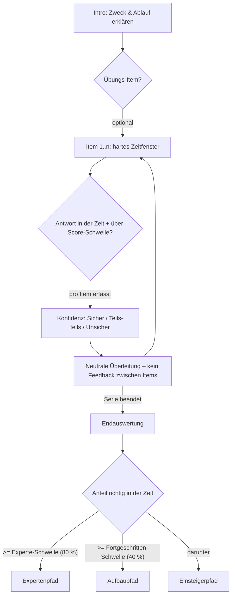

# Benutzerhandbuch: H5P.RapidTimer 2.0 (Rapid-Assessment-Serie)
*Konzeption, Didaktik und Editor-Bedienung in Lumi*

Dieses Handbuch beschreibt die Konfiguration und Verwendung des H5P-Moduls **RapidTimer** (`H5P.RapidTimer`, ab Version 2.0), einer Eigenentwicklung für zeitgesteuerte Diagnose-Serien mit adaptiver Pfad-Weiterleitung.

---

## 1. Didaktischer & Wissenschaftlicher Hintergrund

Das Modul basiert auf der **Cognitive Load Theory (CLT)** (Sweller et al.) und der **Rapid Assessment Method** nach **Slava Kalyuga** – erweitert um metakognitive Kalibrierung (Certainty-Based Marking, Gardner-Medwin) und den **Hypercorrection-Effekt** (Butterfield & Metcalfe).

### Warum eine Item-Serie?
Ein einzelnes Item hat testtheoretisch kaum Reliabilität (Ratewahrscheinlichkeit, Flüchtigkeitsfehler). Kalyuga selbst arbeitet mit **Serien** kurzer Rapid-Items. Ab Version 2.0 entscheidet der **Anteil der richtig UND in der Zeit gelösten Items** über die Einstufung – empfohlen sind **3–7 Items**.

### Der Expertise-Reversal-Effekt & Schema-Erfassung
Das **enge Zeitfenster** (Richtwert: **6–10 Sekunden** pro Item) trennt automatisierten Schema-Abruf (Experten) von zeitaufwendiger Neukonstruktion (Novizen). Wichtig: Zwischen den Items gibt es **kein richtig/falsch-Feedback** – das verhindert Frust-Kaskaden und die Verzerrung der Selbsteinschätzung während des Tests.

### Metakognitive Kalibrierung (3 echte Stufen)
Pro Item wird optional die Sicherheit erfasst – **Sicher**, **Teils-teils**, **Unsicher** sind ab 2.0 drei echte Werte mit sechs Feedback-Varianten:

| | Richtig | Falsch/Zeitablauf |
|---|---|---|
| **Sicher** | Gute Kalibrierung – bestätigen | **Hypercorrection-Fall**: Fehlvorstellung – Erklärung wird prominent gezeigt |
| **Teils-teils** | Wissen festigen | Halbwissen – fehlenden Baustein benennen |
| **Unsicher** | Unterschätzung – ermutigen | Realistischer Novize – Grundlagen anbieten |

Die Endauswertung enthält zusätzlich eine **Kalibrierungsübersicht** (Tendenz zu Über-/Unterschätzung).

### Hypercorrection-Effekt
Fehler, die mit hoher Sicherheit gemacht wurden, werden nach Korrektur am besten behalten – **wenn die richtige Antwort erklärt wird**. Deshalb: Pro Item ein optionales **Erklärungsfeld** pflegen. In der Endauswertung erscheinen „sicher + falsch"-Items **zuerst und mit aufgeklappter Erklärung**.

---

## 2. Editor-Bedienung in Lumi (Autoren-Sicht)

### A. Einführung (`intro`)
Intro-Text vor dem Start. Didaktisch wichtig: erklärt, dass das Zeitlimit ein Diagnosewerkzeug ist und Scheitern kein Makel – reduziert Testangst, die sonst die Diagnose kontaminiert.

### B. Aufgaben-Serie (`items`)
1–10 Aufgaben, je mit:
*   **H5P-Inhalt**: MultiChoice, TrueFalse, Blanks, SingleChoiceSet, MarkTheWords, DragText, Summary
*   **Zeitlimit** (Sekunden): Richtwert 6–10 s; bis 30 s bei kurzen Umformungen
*   **Richtig ab (% der Punkte)**: Score-Schwelle für Partial Credit (Standard 100)
*   **Erklärung**: Warum die richtige Antwort richtig ist (für Endauswertung/Hypercorrection)

### C. Übungs-Item (`practice`)
Optionales unbewertetes Probe-Item vor der Serie – Verfahrensgewöhnung, zählt nicht in die Einstufung.

### D. Zeit & Ablauf (`timing`)
*   **Start des Tests** (`startMode`): `Per Klick` (empfohlen, Orientierungszeit vor dem Messfenster) oder `Bei Sichtbarkeit im Viewport`
*   **Übergang zwischen Aufgaben** (`advanceMode`): `Per Klick` (empfohlen) oder `Automatisch nach 2 s`. Die nächste Aufgabe bleibt bis zum Timer-Start verdeckt.
*   **Warnung ab** (`warningAt`): Countdown färbt sich rot und pulsiert (0 = aus)
*   **Verhalten bei Zeitablauf** (`onTimeout`): `Sperren` (empfohlen, zählt als falsch) oder `Nur Hinweis`
*   **Zeitfaktor** (`timeFactor`): Multipliziert alle Zeitlimits (z. B. 1.5). Nur bewusst als Nachteilsausgleich/barrierefreie Variante einsetzen. 1.0 = kein Effekt.

**Timer-Garantien**: Die Messung ist Timestamp-basiert – Tab-Wechsel verlängert die Zeit nicht. Der Timer startet erst, wenn die Aufgabe gerendert und sichtbar ist. Ein Reload mitten in einer Aufgabe zählt als Zeitablauf dieser Aufgabe (kein Zeit-Cheat).

### E. Kalibrierung (`confidence`)
Ein/Aus, Zeitpunkt (`nach der Antwort` empfohlen – die Lösung wird bis zur Einschätzung verdeckt), Frage, Abdeckungstext und sechs Feedbacktexte (3 Stufen × richtig/falsch).

### F. Einstufung (`classification`)
*   **Experte ab (%)**: Standard 80
*   **Fortgeschritten ab (%)**: Standard 40

Ist keine URL für den Fortgeschrittenen-Pfad gesetzt, gilt 2-Pfad-Verhalten: ab Experten-Schwelle Experte, darunter Novize.

### G. Lernpfade (`paths`)
URL + Beschriftung je Stufe (Experte/Fortgeschritten/Novize), Weiterleitung klickbar (empfohlen) oder automatisch nach Wartezeit. Relative Links (z. B. `/goto.php?target=pg_123` oder `#anker`) funktionieren für ILIAS/Moodle.

### H. Verhalten (`behaviour`)
*   **Nach Abschluss sperren** (`lockAfterCompletion`, empfohlen): Die Diagnose ist nicht wiederholbar; ein Reload zeigt nur die Auswertung. Deaktivieren nur für reine Übungsszenarien.
*   Beschriftungen (Start-/Weiter-Button, Fortschrittstext) und Einstufungstexte je Stufe.

---

## 3. Ablauf für Lernende (Runtime-Sicht)

1.  **Intro**: Zweck und Ablauf, Start per Klick (oder bei Sichtbarkeit).
2.  **Optional Übungs-Item**: gleiche Mechanik, zählt nicht.
3.  **Item-Serie**: Pro Aufgabe läuft der Countdown mit Balken; bei Warnschwelle pulsiert die Anzeige. Nach der Antwort (bzw. Zeitablauf) folgt ggf. die Konfidenzabfrage – die Lösung ist dabei verdeckt. Danach eine **neutrale Überleitung** ohne richtig/falsch.
4.  **Endauswertung**: Gesamtergebnis („x von n in der Zeit richtig"), Einstufungstext, Kalibrierungsübersicht und Item-Rückblick. „Sicher + falsch"-Aufgaben stehen oben mit offener Erklärung; alle anderen Erklärungen sind aufklappbar. Darunter der Pfad-Link.

---

## 4. Best Practices für Instructional Designer

1.  **5±2 Items**: Weniger als 3 Items = unzuverlässige Diagnose; mehr als 7 = Ermüdung. Alle Items sollten dasselbe Konstrukt prüfen.
2.  **Fokussierte Aufgabentexte**: Lange Lesezeiten verfälschen die Schema-Diagnose. Eine Frage, ein Konzept.
3.  **Erklärungen pflegen**: Das Erklärungsfeld pro Item ist der Hebel für den Hypercorrection-Effekt – kurz begründen, *warum* die richtige Antwort richtig ist, nicht nur *was* richtig ist.
4.  **Schwellen bewusst setzen**: 80/40 ist ein guter Start. Bei nur einem Pfadpaar (Experte/Novize) die Fortgeschritten-URL leer lassen.
5.  **Score-Schwelle bei Teilpunkt-Aufgaben senken**: MultiChoice mit 5 Optionen und Teilpunkten ggf. auf 80 % stellen, sonst misst du Perfektion statt Schema-Abruf.
6.  **Zeitfaktor als eigene Inhaltsvariante**: Für Nachteilsausgleich eine Kopie des Inhalts mit `timeFactor 1.5` bereitstellen, statt das Limit für alle zu erhöhen.
7.  **Sperre aktiv lassen**: `lockAfterCompletion` schützt die diagnostische Aussagekraft. Wiederholbarkeit nur für reine Übungsformate.
