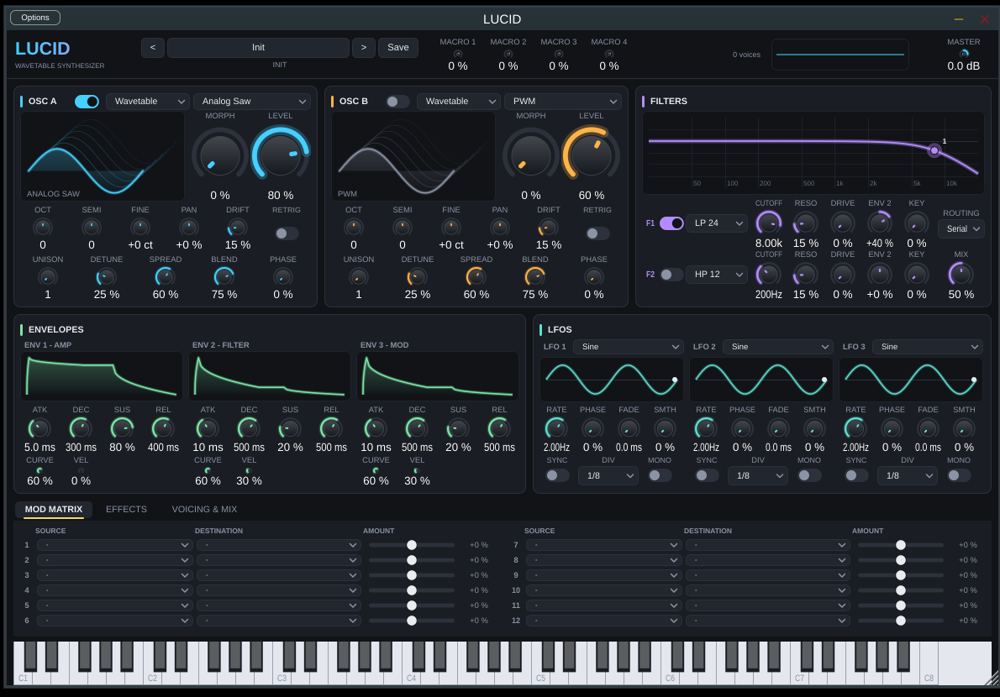
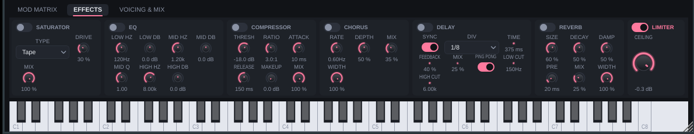
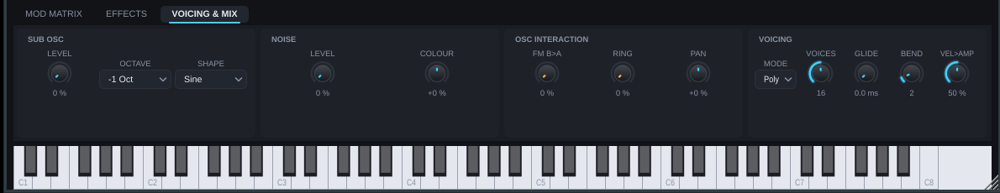

# LUCID — Wavetable-Synthesizer für Logic Pro (AU) und VST3

LUCID ist ein polyphoner Software-Synthesizer in C++/JUCE. Ziel: **ultra-klare Sounds** durch
durchgehend alias-freie Synthese, Zero-Delay-Feedback-Filter, oversampelte Sättigung und eine
Effektkette in Mastering-Qualität — mit einer Oberfläche, die sich an Omnisphere, Pigments und
FabFilter orientiert: dunkel, ruhig, alles sichtbar, alles animiert.

Logic Pro lädt **Audio Units (AU)** — das ist das Format, das dieses Projekt für Logic erzeugt.
Zusätzlich entstehen **VST3** (Ableton, Cubase, Bitwig, Reaper …) und eine **Standalone-App**.



| Effekte | Voicing & Mix |
|---|---|
|  |  |

---

## Inhalt

- [Features](#features)
- [Build für Logic Pro (macOS)](#build-für-logic-pro-macos)
- [Bedienung](#bedienung)
- [Architektur](#architektur)
- [Klangqualität – was LUCID anders macht](#klangqualität--was-lucid-anders-macht)
- [Tests](#tests)
- [Projektstruktur](#projektstruktur)

---

## Features

**Synthese**
- 2 Oszillatoren, je wahlweise **Wavetable-Engine** (14 Factory-Tables mit Frame-Morphing) oder
  **Virtual-Analog-Engine** (Saw / Square mit PWM / Triangle / Sine, Analog-Drift)
- Sämtliche Wellenformen **mip-gemappt und bandlimitiert** (per FFT erzeugt) → kein Aliasing,
  auch bei C7 mit Unison und FM (gemessen: nicht-harmonische Anteile < -90 dB)
- **Unison** bis 8 Stimmen pro Oszillator mit Detune, Stereo-Spread, Blend und zufälligen Startphasen
- **FM** (B → A Phasenmodulation), **Ringmodulation**, Sub-Oszillator (-1/-2 Okt), Stereo-Noise mit Colour
- 32 Stimmen Polyphonie, Mono- und Legato-Modus, Glide, Sustain-Pedal, Pitchbend, Aftertouch
- Voice-Stealing (leiseste auslaufende Stimme zuerst)

**Filter**
- 2 True-Stereo-Filter: **ZDF State-Variable** (LP12/LP24/HP12/HP24/BP/Notch) und
  **Transistor-Ladder** (Huovilainen-Modell, 2× oversampelt, tanh-Sättigung)
- Drive-Stufe, Keytracking, Hüllkurven-Amount, Routing seriell / parallel / split
- Interaktives Filter-Display: Cutoff/Resonanz direkt in der Kurve ziehen, Analyzer im Hintergrund

**Modulation**
- 3 ADSR-Hüllkurven mit **analogen Exponentialsegmenten** und Curve-Regler
- 3 LFOs (Sine, Tri, Saw ↑↓, Square, S&H, Smooth Random), Tempo-Sync, Fade-In, Mono/Poly, Smoothing
- 12-Slot **Modulationsmatrix**, 16 Quellen × 33 Ziele, bipolare Amounts
- 4 **Macros** im Header, Mod Wheel, Aftertouch, Velocity, Keytrack, Random pro Note

**Effekte (Master-Kette)**
- Saturator (Tape / Tube / Fold / Hard), 2× oversampelt mit elliptischem Halbband-Filter (> 104 dB)
- 3-Band-EQ (Low Shelf, Peak, High Shelf, RBJ-Biquads)
- Kompressor (Soft-Knee, Feed-Forward, Parallel-Mix)
- Chorus (3 Taps pro Kanal, Stereo-Width)
- Stereo-/Ping-Pong-Delay mit Tempo-Sync, Low-/High-Cut im Feedback, tape-artiges Time-Gliding
- FDN-Reverb (8 modulierte Lines, Householder-Matrix, Diffusion, Pre-Delay, Damping, Width)
- Lookahead-Brickwall-Limiter (Latenz wird an den Host gemeldet)

**Presets**
- 21 Factory-Presets (Pads, Keys, Bass, Leads, Plucks, Sequences, FX)
- User-Presets als XML in `~/Documents/LUCID/Presets/*.lucid`

---

## Build für Logic Pro (macOS)

**Weg A – fertiges Plug-in herunterladen (kein Compiler nötig):**
Jeder Push baut LUCID automatisch per GitHub Actions auf einem macOS-Runner. Im Repository unter
*Actions → „Build LUCID (macOS AU/VST3)“ → letzter Lauf → Artifacts → `LUCID-macOS.zip`*
herunterladen, entpacken und `LUCID.component` nach `~/Library/Audio/Plug-Ins/Components/` kopieren.
Weil der Download nicht notarisiert ist, einmalig die Quarantäne entfernen:
```bash
xattr -dr com.apple.quarantine ~/Library/Audio/Plug-Ins/Components/LUCID.component
```

**Weg B – selbst bauen:** Voraussetzungen: Xcode Command Line Tools (`xcode-select --install`),
CMake (`brew install cmake`), Internetverbindung (JUCE wird beim ersten Konfigurieren geladen).

```bash
cd lucid-synth
./build-mac.sh --validate      # baut AU/VST3/Standalone, installiert sie und startet auval
```
oder manuell:
```bash
cmake -B build -DCMAKE_BUILD_TYPE=Release
cmake --build build --config Release -j
```

Der Build erzeugt ein **Universal Binary** (Apple Silicon + Intel) und kopiert die Plug-ins
automatisch in die Benutzer-Ordner:

| Format     | Ziel                                              |
|------------|---------------------------------------------------|
| AU         | `~/Library/Audio/Plug-Ins/Components/LUCID.component` |
| VST3       | `~/Library/Audio/Plug-Ins/VST3/LUCID.vst3`        |
| Standalone | `build/LucidSynth_artefacts/Release/Standalone/LUCID.app` |

**In Logic Pro:**
1. Logic neu starten (bzw. `Logic Pro → Einstellungen → Plug-in-Manager → Zurücksetzen & erneut
   scannen`, falls LUCID nicht auftaucht).
2. Neue Software-Instrument-Spur → Instrument-Slot → **AU Instrumente → Lucid Audio → LUCID**.
3. Presets über den Preset-Browser im Plug-in-Header (Pfeile / Name anklicken).

Falls macOS das Plug-in wegen fehlender Signatur blockiert (nur bei fremden Builds relevant):
`xattr -dr com.apple.quarantine ~/Library/Audio/Plug-Ins/Components/LUCID.component`

**AU-Validierung** (empfohlen nach dem Build):
```bash
auval -v aumu Lcd1 Lcda
```

**Linux / Windows:** Gleiche Befehle; es entstehen VST3 + Standalone (AU nur unter macOS).
Unter Linux werden `libasound2-dev libx11-dev libxrandr-dev libxinerama-dev libxcursor-dev
libfreetype-dev libfontconfig1-dev libgl1-mesa-dev libcurl4-openssl-dev` benötigt.

---

## Bedienung

```
┌ HEADER ──────────────────────────────────────────────────────────────────────────┐
│ LUCID   ◀ [Preset-Name] ▶ Save    MACRO 1-4      Stimmen   Oszilloskop/Meter  MASTER │
├ OSC A ────────────────┬ OSC B ────────────────┬ FILTERS ──────────────────────────┤
│ Wavetable-3D-Display  │ …                     │ Frequenzgang F1/F2 + Analyzer      │
│ Morph/PW, Level       │                       │ (Cutoff/Reso per Maus ziehen)      │
│ Oct Semi Fine Pan     │                       │ F1: Typ Cutoff Reso Drive Env Key  │
│ Unison Detune Spread  │                       │ F2: …            Routing   Mix     │
├ ENVELOPES ────────────────────────────────────┬ LFOS ──────────────────────────────┤
│ Env1 Amp · Env2 Filter · Env3 Mod (animiert)  │ LFO 1-3 mit Shape, Rate, Sync …    │
├ [Mod Matrix] [Effects] [Voicing & Mix] ───────────────────────────────────────────┤
│ 12 Slots: Quelle → Ziel, Amount                                                    │
├ MIDI-Keyboard ────────────────────────────────────────────────────────────────────┤
```

- **Doppelklick** auf einen Regler = Standardwert. **Mausrad** über Reglern ändert Werte fein.
- Das Fenster ist **frei skalierbar** (Seitenverhältnis fix, 50 % – 200 %).
- **Macros** sind reine Modulationsquellen: In der Matrix `Macro 1 → Cutoff (All)` zuweisen, dann
  den Macro-Regler in Logic automatisieren (er erscheint als Plug-in-Parameter).
- **Env 2** ist fest mit dem Filter-Amount jedes Filters verdrahtet („ENV 2“-Regler), kann aber
  zusätzlich frei in der Matrix verwendet werden. **Env 3** ist ein reiner Modulations-Envelope.
- **LFO Mono** = ein globaler LFO für alle Stimmen (Tremolo, Filter-Wobble im Takt),
  aus = pro Stimme retriggert.

---

## Architektur

```
Source/
  dsp/            reiner C++17-DSP-Kern, keine JUCE-Abhängigkeit, header-only
    Core.h        Mathe, Smoother, RNG, DC-Blocker, One-Pole, Pan
    FFT.h         Radix-2-FFT für die Wavetable-Erzeugung
    Wavetable.h   Mipmap-Wavetables + Factory-Bank (14 Tables)
    Oscillators.h Wavetable-/VA-Oszillator mit Unison, Sub-Osc, Noise
    Filters.h     ZDF-SVF, Ladder, elliptischer Halbband-Oversampler
    Envelope.h    ADSR (Target-Ratio-Exponentialsegmente)
    LFO.h         LFO mit Sync, Fade, S&H, Smooth Random
    Voice.h       eine Stimme: Osc→Filter→Amp + Modulationsmatrix (Control-Rate 16 Samples, linear interpoliert)
    SynthEngine.h Voice-Allocation, Mono/Legato, globale LFOs, FX-Modulation
    Effects.h     Saturator, EQ, Kompressor, Chorus, Delay, FDN-Reverb, Limiter
    Params.h      SynthParams-Snapshot (Plugin → Engine, einmal pro Block)
  Parameters.*    APVTS-Layout (~190 Parameter), Cache mit atomaren Zeigern
  Presets.*       Factory-Presets, User-Presets, Programmwechsel
  PluginProcessor.* JUCE-Prozessor: sample-genaues MIDI, Effekte, Zustands-Speicherung, UI-Feeds
  PluginEditor.*  Layout (1180×780, skaliert)
  ui/             LookAndFeel, Displays (Wavetable, Filter+Analyzer, Env, LFO, Scope), Panels
tests/
  dsp_tests.cpp   35 Offline-Checks (Aliasing, Filterstabilität, Hüllkurven-Timing, Voicing, FX, Mod)
```

Der Audio-Thread liest alle Parameter lock-frei aus dem APVTS in einen `SynthParams`-Snapshot,
teilt den Block an MIDI-Events auf (sample-genaue Note-Ons), rendert Stimmen in Stereo und
schickt die Summe durch die Effektkette. Alle Reglerbewegungen werden im DSP geglättet
(Cutoff 4 ms, Morph 15 ms, Mix/Level 20 ms) — keine Zipper-Artefakte.

---

## Klangqualität – was LUCID anders macht

| Thema | Umsetzung |
|---|---|
| Aliasing | Jede Wellenform wird als Spektrum definiert und pro Oktavband (10 Mipmaps) per IFFT so gerendert, dass keine Harmonische über Nyquist liegt. Zwischen Mipmaps wird gecrossfadet. PWM entsteht aus zwei bandlimitierten Sägezähnen (exakt, kein DC). |
| Filter | Trapez-Integration (Zero-Delay-Feedback) → korrekte Stimmung bei hoher Resonanz, stabil bei schnellster Modulation. Ladder mit tanh-Stufen bei 2× Oversampling. |
| Sättigung | 2× Oversampling mit 12-Koeffizienten-Polyphase-IIR (Übergangsband 0.01 fs, > 104 dB Sperrdämpfung, < 1e-9 dB Ripple). |
| Hüllkurven | Exponentielle Segmente wie bei analogen Schaltungen; Attack-Zeit trifft auf ±2 ms genau. |
| Unison | Nichtlineare Detune-Verteilung, Startphasen randomisiert (kein Kammfilter beim Anschlag), Pegel √n-normalisiert. |
| Reverb | 8-Line-FDN mit Householder-Rückkopplung und modulierten Delays → dichte, metallfreie Fahne. |
| Ausgang | Lookahead-Limiter (2 ms) mit gleitendem Minimum + Mittelung: kein Overshoot, keine Klicks. Sicherheits-Clipper ist unterhalb 0.9 exakt linear. |
| Denormals | `ScopedNoDenormals` + Sanitizer im Reverb/Ausgang. |

---

## Tests

Die DSP-Tests laufen ohne JUCE und ohne Audio-Hardware:

```bash
cmake --build build --target lucid_dsp_tests && ./build/lucid_dsp_tests
# oder direkt:
g++ -std=c++17 -O2 tests/dsp_tests.cpp -o dsp_tests && ./dsp_tests
```

Sie schreiben außerdem `lucid_demo.wav` (6 s Akkordfolge durch die komplette Engine) zum Anhören.

---

## Projektstruktur / Lizenz

JUCE wird über CMake `FetchContent` (Tag 8.0.4) geladen und unterliegt der JUCE-Lizenz
(GPLv3 oder kommerzielle Lizenz — für einen App-Store-/Verkaufs-Release ist eine JUCE-Lizenz nötig).
Der Code von LUCID selbst steht unter der MIT-Lizenz des Repositories.
